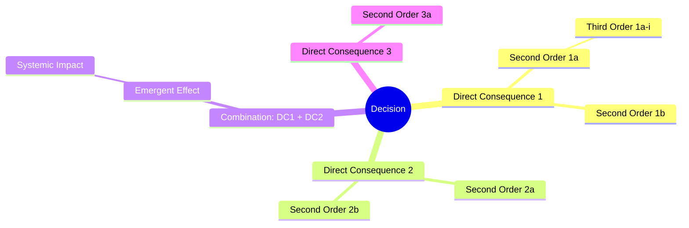

 
# AI-Powered Futures Wheel
 
Map the direct and indirect consequences of any decision, event, or trend — before you commit to it. The Futures Wheel is a structured brainstorming tool originally developed by Jerome C. Glenn that expands outward from a central decision through concentric rings of consequences.
 
This skill pairs the visual logic of the Futures Wheel with AI-driven analysis to surface the hidden impacts a standard pros/cons list will miss. It works as a **collaborative, step-by-step process** — the human stays in the driver's seat and can steer, challenge, or redirect the analysis at every stage.
 
> "A standard pros and cons list might not surface hidden impacts — like how a small tweak to your product's pricing could strain customer support or trigger unexpected PR issues."
 
---
 
## Why Step-by-Step Matters
 
Futures thinking is inherently collaborative. If the AI dumps the entire wheel at once, the human loses the ability to shape it — and the analysis becomes a monologue instead of a conversation. Each step builds on the previous one, and the human's judgment at each stage makes the next stage better. The pauses aren't a formality; they're where the best insights happen.
 
---
 
## How the Futures Wheel Works
 
The wheel has four layers (three concentric rings plus combination effects):
 
**Ring 1 — Direct Consequences (First-Order)**
The immediate, obvious outcomes that most people already anticipate. What happens directly because of the decision? Include both positive and negative outcomes.
 
**Combination Effects**
What happens when two or more Ring 1 consequences collide? Randomly pair or group direct consequences and examine what emergent outcomes their interaction creates. This is where the Futures Wheel earns its keep — combination effects are the consequences that almost nobody anticipates because they require two things to be true simultaneously.
 
**Ring 2 — Indirect Consequences (Second-Order)**
All the new impacts that come from both individual Ring 1 consequences and their combinations. Highlight any particularly surprising or hidden impacts.
 
**Ring 3 — Systemic Consequences (Third-Order)**
What happens as a result of the second-order consequences? These represent the long arc of a decision playing out over time. Select only the most significant Ring 2 consequences to trace forward.
 
**Hidden Impacts**
Consequences that don't fit neatly into the ring structure but are important: ethical implications, effects on vulnerable or marginalized groups, second-victim effects (who is harmed indirectly), and low-probability/high-severity edge cases.
 
---
 
## The Step-by-Step Process
 
This is the core of how to run the analysis. Follow these steps in order. **Stop after each step and wait for the human's explicit go-ahead before proceeding.**
 
### Step 1: Subject Overview
 
Summarize the decision, event, or trend in 1–2 sentences so both sides are clear on what's being analyzed. Include the stated goal or motivation behind the decision if known.
 
If the human hasn't specified an analyst mode, briefly mention the available modes (see below) and ask if they want a specific lens or the default balanced analysis.
 
**Then STOP.** Wait for the human to confirm the framing is correct, adjust the scope, or choose an analyst mode before moving on.
 
### Step 2: Direct Consequences (Ring 1)
 
List 5–7 first-order (direct) consequences that might result from this decision. Include both positive and negative outcomes — don't cluster all the good news first.
 
For each consequence, assign:
- **Confidence:** A probability range (e.g., "70% ±10%") plus a qualitative label (High / Medium / Low) for quick scanning
- **Evidence level:** Strong (grounded in data or precedent), Moderate (reasonable inference), or Speculative (plausible but unproven)
- **Primary dimension affected:** Which area this hits hardest (see Analysis Dimensions below)
 
After listing them, briefly note if there are obvious gaps — dimensions that aren't represented, stakeholders whose perspective is missing, or consequences that feel too safe/obvious. This self-challenge helps the human decide what to add.
 
**Then STOP.** Wait for the human to modify, add, remove, or reorder consequences before moving on.
 
### Step 3: Combination Effects
 
This is where the analysis gets interesting. Take the confirmed Ring 1 consequences and pair or group them to surface emergent outcomes:
 
1. Select 3–5 pairings (or groupings of 3) of Ring 1 consequences. Prioritize unexpected combinations over obvious ones — if Consequence A and Consequence C both happen, what new effect emerges that neither would produce alone?
2. For each combination, describe the emergent outcome and assign a confidence level.
3. Flag any combinations that create feedback loops (where the combination effect reinforces one of the original consequences).
 
The goal is to find the consequences that hide in the spaces between obvious outcomes. A pricing change alone might be fine; a pricing change combined with a competitor's new free tier creates a completely different situation.
 
**Then STOP.** Wait for the human to review these combination effects. They may spot pairings that were missed or want to explore a specific interaction more deeply.
 
### Step 4: Indirect Consequences (Ring 2)
 
Now map the full second-order landscape. For each confirmed Ring 1 consequence AND each confirmed combination effect, list 2–3 indirect consequences.
 
Highlight any that are:
- **Surprising** — not an obvious extension of the first-order effect
- **Cross-dimensional** — an operational consequence that creates an ethical problem, a financial consequence that shifts competitive dynamics, etc.
- **Irreversible** — consequences that would be difficult or impossible to undo
 
**Then STOP.** Let the human review these impacts before tracing the systemic consequences.
 
### Step 5: Systemic Consequences (Ring 3) & Hidden Impacts
 
Select the 3–5 most significant Ring 2 consequences and trace their third-order effects. Focus on consequences that compound over time or affect the decision-maker's ability to make future decisions.
 
Then surface the Hidden Impacts:
 
**Ethical / Equity**
Who might be harmed who isn't the obvious user? What vulnerable or marginalized groups are affected? Consider accessibility, economic inequality, digital literacy, and power asymmetries.
 
**Low-Probability / High-Severity**
What's the tail risk — unlikely but catastrophic if it occurs?
 
**Second-Victim Effects**
Who is affected by the effects on others, not directly by the decision itself? (Example: a layoff's effect on the remaining team, not just those laid off.)
 
**Then STOP.** Wait for the human to review before the summary.
 
### Step 6: Summary & Next Steps
 
Provide:
 
1. **The Three Most Important Consequences** — across any ring — that most deserve attention before committing to this decision. These are the things most likely to be missed without this analysis.
 
2. **Recommended Next Steps** — concrete actions to take before, during, or after implementing the decision. These might be design changes, additional research, safeguards to build, monitoring systems, or conversations to have.
 
3. **Optional: Light Wheel** — the most significant positive consequences across the rings. The upside scenarios worth designing toward.
 
Wait for the human's final feedback before considering the analysis complete.
 
---
 
## Analysis Dimensions
 
For each ring, assess consequences across these dimensions. Not every dimension applies to every decision — use judgment to focus on what's relevant.
 
| Dimension | What to Look For |
|-----------|-----------------|
| Operational | Team capacity, processes, support load, infrastructure |
| Financial | Revenue, costs, pricing pressure, investor signals |
| User & Trust | User behavior changes, trust signals, churn risk |
| Ethical | Privacy, fairness, harm to vulnerable groups, manipulation risk |
| Reputational | PR risk, media framing, stakeholder perception |
| Competitive | How competitors respond, market positioning shifts |
| Regulatory | Legal exposure, compliance burden, regulatory attention |
| Cultural | Team morale, norms, values alignment |
 
---
 
## AI Analyst Modes
 
The analysis can adopt different lenses to surface different types of consequences. Ask the human which mode they want, or default to the balanced Futurist lens.
 
- **Default Futurist** — Balanced analysis across all dimensions
- **Pessimist** — Focus on what could go wrong, edge cases, failure modes
- **Optimist** — Surface upside scenarios and compounding positive effects
- **Ethicist** — Focus on harm, fairness, and vulnerable populations
- **Regulator** — Focus on legal and compliance implications
- **Competitor** — How would a competitor exploit or respond to this decision?
- **Domain Expert** — Respond from a specific expert POV (physician, economist, educator, etc.)
 
Multiple modes can be combined. Running the same decision through Optimist + Pessimist + Ethicist produces a much richer picture than any single lens.
 
---
 
## Adapting the Analysis
 
After the initial output, the wheel can be extended or redirected:
 
**Change the actor:** Re-run the analysis from the perspective of a specific stakeholder (your most vulnerable user, a competitor, a regulator, a journalist).
 
**Deep dive:** If one consequence looks significant, run a full sub-wheel on that consequence as a new central event.
 
**Change the output format:** Request a Mermaid diagram for documentation, an XML export for draw.io or Miro, or a structured report for stakeholder communication.
 
---
 
## Mermaid Diagram Export
 
If the human wants a visual representation, render the wheel as a Mermaid mindmap. Include combination effects as a distinct branch:
 

 
---
 
## Reference Framework
 
Grounded in Matthew Stephens' AI-powered Futures Wheel method, which builds on Jerome C. Glenn's original Futures Wheel and extends it with:
 
- Probabilistic confidence ranges for each consequence (not just binary good/bad)
- Evidence level ratings to separate grounded analysis from speculation
- Combination effects that surface emergent outcomes from interacting consequences
- AI as a collaborative second brain that questions, challenges, and cross-checks — not just a list generator
- Explicit hidden impact sections for ethical and equity consequences that get missed in standard analysis
- A step-by-step collaborative process where human judgment shapes each stage of the analysis
 
The goal is not to predict the future. It is to expand the range of futures you've considered before you commit.